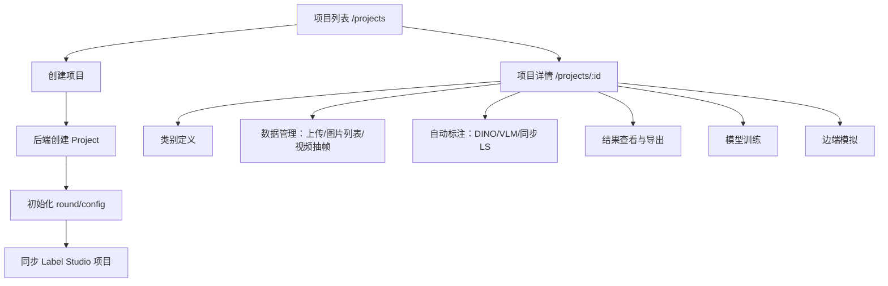

# 项目管理页面整体逻辑与代码审查报告

审查日期：2026-05-21
审查范围：`项目管理`列表页、项目详情页，以及详情页串联的类别定义、数据管理、自动标注、结果导出、模型训练、Label Studio 跳转等核心链路。
审查方式：静态代码审查 + 接口契约比对 + 一次后端编译验证。

## 1. 结论摘要

当前项目管理页面已经具备完整业务骨架：项目列表、项目创建、类别定义、图片上传、自动标注、结果查看、导出和训练入口都已经串起来。但从“项目管理”作为生产级核心页面来看，存在几个会直接影响数据安全、用户体验和功能正确性的风险：

| 等级 | 问题 | 影响 |
| --- | --- | --- |
| P0 | 多个项目相关接口只按 `projectId` 查询，没有校验当前用户/组织是否有权限 | 任意登录用户可能访问、删除、导出或操作其他组织项目 |
| P0 | Label Studio 明文密码、Token/密钥配置和前端凭证展示方式风险较高 | 凭证泄露风险高，且不利于审计与合规 |
| P0 | 上传接口没有对 `filename` 做安全归一化，服务端直接拼接路径 | 可被构造路径穿越、覆盖文件或污染上传目录 |
| P1 | 项目列表接口和前端分页控件契约不一致 | 分页总数错误，用户只能看到当前页数量，文档/实现/页面三者不一致 |
| P1 | 标签数据结构和状态枚举在文档、前端、后端之间漂移 | 列表状态显示不全，标签可能为空/重复/非法，LS 配置可能失败 |
| P1 | 视频抽帧入口前端已展示，但后端没有对应 `/upload/extract-frames` 接口 | 用户点击后必然失败 |
| P1 | 自动标注缺少并发任务保护、取消状态表达不清，结果接口未实现 | 重复启动可能互相清理结果，取消会把项目标成失败 |
| P2 | 删除项目没有清理物理上传文件，导出用 data URL 返回大文件 | 存储泄露、浏览器内存压力和下载稳定性问题 |
| P2 | 前端存在调试日志、未实现按钮、错误提示重复/不足 | 体验和可维护性下降 |

后端编译验证：

```bash
cd /root/autodl-fs/Annotation-Platform/backend-springboot
mvn test -DskipTests
# BUILD SUCCESS；当前没有 test source，测试被跳过
```

前端验证限制：

```bash
cd /root/autodl-fs/Annotation-Platform/frontend-vue
npm run build
# 失败：当前环境没有 npm
```

## 2. 业务链路梳理

项目管理页面的核心链路如下：



主要代码入口：

| 层级 | 文件 |
| --- | --- |
| 前端路由 | `frontend-vue/src/router/index.js` |
| 项目列表 | `frontend-vue/src/views/ProjectList.vue` |
| 项目详情 | `frontend-vue/src/views/ProjectDetail.vue` |
| 类别定义 | `frontend-vue/src/components/LabelDefinition.vue` |
| 数据管理 | `frontend-vue/src/components/DataManager.vue`、`FileUpload.vue`、`ImageList.vue`、`VideoExtract.vue` |
| 自动标注 | `frontend-vue/src/components/AlgorithmTasks.vue`、`backend-springboot/src/main/java/com/annotation/platform/controller/AutoAnnotationController.java`、`AutoAnnotationService.java` |
| 结果导出 | `frontend-vue/src/components/ResultExport.vue`、`ProjectController.exportResults` |
| 后端项目接口 | `backend-springboot/src/main/java/com/annotation/platform/controller/ProjectController.java` |
| 项目实体/仓库 | `Project.java`、`ProjectRepository.java` |

## 3. 关键问题与改进建议

### P0-1：项目级权限校验缺失

证据：

- `ProjectController.getProject` 直接 `projectRepository.findById(id)`，没有校验组织：`ProjectController.java:113-124`
- `updateProject`、`deleteProject`、`getProjectImages`、`getProjectStats`、`review-stats`、`review-results`、`export` 等路径也都是类似模式：`ProjectController.java:158-260`、`264-380`、`525-640`
- `LabelStudioController.getLoginUrl`、`syncProject` 也按 projectId 直接取项目：`LabelStudioController.java:31-60`
- `AutoAnnotationController.startAutoAnnotation`、`getJob`、`getLatestProjectJob` 没有检查 job/project 是否属于当前用户组织：`AutoAnnotationController.java:29-64`、`139-152`

风险：

任意登录用户只要猜到项目 ID，就可能查看项目详情、获取图片列表、导出结果、删除项目、同步/打开其他项目的 Label Studio 项目、取消他人的自动标注任务。

建议：

1. 在仓库层增加组织限定查询。
2. 在控制器层统一使用 `requireProjectInOrg`。
3. Job、训练记录、上传也要通过项目反查组织，不能只信任 `projectId`。

参考代码：

```java
// ProjectRepository.java
Optional<Project> findByIdAndOrganizationId(Long id, Long organizationId);

boolean existsByNameAndOrganizationIdAndIdNot(String name, Long organizationId, Long id);
```

```java
// ProjectController.java
private Project requireProjectInCurrentOrg(Long projectId, HttpServletRequest request) {
    Long organizationId = (Long) request.getAttribute("organizationId");
    if (organizationId == null) {
        throw new BusinessException("当前用户没有组织，无法访问项目");
    }
    return projectRepository.findByIdAndOrganizationId(projectId, organizationId)
            .orElseThrow(() -> new ResourceNotFoundException("Project", "id", projectId));
}

@GetMapping("/{id}")
@Transactional(readOnly = true)
public Result<ProjectDetailResponse> getProject(@PathVariable Long id, HttpServletRequest request) {
    Project project = requireProjectInCurrentOrg(id, request);
    return Result.success(convertToDetailResponse(project));
}
```

```java
// AutoAnnotationController.java
@GetMapping("/jobs/{jobId}")
public Result<Map<String, Object>> getJob(@PathVariable Long jobId, HttpServletRequest request) {
    AutoAnnotationJob job = autoAnnotationService.requireJobVisibleToCurrentOrg(jobId, request);
    return Result.success(autoAnnotationService.getJobStatus(job.getId()));
}
```

### P0-2：明文凭证和敏感配置暴露

证据：

- 前端项目详情页直接展示 LS 邮箱和密码：`ProjectDetail.vue:16-43`
- 用户资料响应 DTO 包含 `lsPassword`：`UserProfileResponse.java:37-41`
- 用户实体保存 `ls_plain_password`：`User.java:59-63`
- `UserServiceImpl.getUserProfile` 将明文密码放入响应：`UserServiceImpl.java:203-239`
- `application.yml` 中存在硬编码 JWT secret 和 Label Studio admin-token：`application.yml:77-98`。本报告不展开密钥值。

风险：

1. 任何 XSS、截屏、浏览器插件、日志代理都可能拿到 LS 明文密码。
2. 配置文件进入仓库后，密钥轮换成本高。
3. `lsPassword` 作为常规 profile 字段返回，所有进入项目详情页的页面请求都会携带敏感信息。

建议：

- 不要在常规 profile API 返回明文密码。
- 项目详情页只显示“已同步/未同步”和“一键打开 LS”。
- 如必须支持临时查看，单独做受控接口，短期令牌、二次确认、审计日志、一次性显示。
- `application.yml` 改成环境变量占位。

参考代码：

```yaml
app:
  security:
    jwt:
      secret: ${APP_JWT_SECRET}
  label-studio:
    admin-token: ${LABEL_STUDIO_ADMIN_TOKEN}
```

```java
// UserProfileResponse.java
private Boolean lsSyncStatus;
private Long lsUserId;
private String lsEmail;
// 删除 lsPassword，或者仅在专用接口中返回 masked 状态
```

```vue
<!-- ProjectDetail.vue -->
<el-alert v-if="userProfile.lsEmail" type="info" :closable="false">
  <template #title>Label Studio 已同步</template>
  <span>{{ maskEmail(userProfile.lsEmail) }}</span>
</el-alert>
```

### P0-3：上传文件名未做服务端安全归一化

证据：

- 前端把 `file.name` 直接传给后端：`FileUpload.vue:107-123`
- 后端接收 `filename` 后直接写入分块文件和合并文件：`FileUploadController.java:34-63`、`FileUploadServiceImpl.java:111-135`
- `mergeChunks` 中 `new File(projectDir, filename)` 未限制最终路径必须位于项目目录：`FileUploadServiceImpl.java:127-135`
- `deleteFile` 用传入路径直接拼接删除：`FileUploadController.java:77-81`、`FileUploadServiceImpl.java:300` 附近后续方法

风险：

恶意请求可以构造 `filename=../xxx.jpg` 或复杂路径，导致写入项目目录外部；`deleteFile` 也存在越权删除风险。浏览器正常上传通常只给 basename，但 API 不能依赖浏览器行为。

建议：

- 所有文件名取 basename 后白名单替换。
- 使用 `Path.normalize()` + `startsWith(root)` 校验。
- 上传、合并、删除必须校验项目归属。
- 对 ZIP 解压也要做唯一文件名和路径保护。

参考代码：

```java
private String sanitizeFilename(String filename) {
    if (filename == null || filename.isBlank()) {
        throw new BusinessException(ErrorCode.FILE_004, "文件名为空");
    }
    String baseName = Paths.get(filename).getFileName().toString();
    String safe = baseName.replaceAll("[^a-zA-Z0-9._-]", "_");
    if (safe.isBlank() || safe.equals(".") || safe.equals("..")) {
        throw new BusinessException(ErrorCode.FILE_004, "文件名非法");
    }
    return safe;
}

private Path resolveInside(Path root, String filename) {
    Path normalizedRoot = root.toAbsolutePath().normalize();
    Path target = normalizedRoot.resolve(sanitizeFilename(filename)).normalize();
    if (!target.startsWith(normalizedRoot)) {
        throw new BusinessException(ErrorCode.FILE_004, "文件路径非法");
    }
    return target;
}
```

```java
Path projectRoot = Paths.get(basePath, String.valueOf(projectId));
Files.createDirectories(projectRoot);
Path mergedPath = resolveInside(projectRoot, request.getFilename());
```

### P1-1：项目列表分页契约错误

证据：

- 前端项目列表使用分页控件，并传 `page=currentPage-1`、`size=pageSize`：`ProjectList.vue:41-50`、`263-266`
- 后端确实用 `PageRequest` 查询：`ProjectController.java:127-155`
- 但后端只返回当前页数组 `Result<List<ProjectDetailResponse>>`，没有返回 `totalElements`、`totalPages`：`ProjectController.java:151-155`
- 前端把 `total` 设置为当前页数组长度：`ProjectList.vue:268-270`
- 旧 API 文档写的是 `{ content, pageable }`：`api-design.md:282-325`

影响：

列表页只能显示“当前页数量”，分页器不知道真实总数；当项目数超过当前页大小时，用户无法正确跳页。文档、后端、前端三者互相不一致。

建议后端返回分页对象：

```java
@GetMapping
@Transactional(readOnly = true)
public Result<Map<String, Object>> getProjects(
        @RequestParam(defaultValue = "0") int page,
        @RequestParam(defaultValue = "20") int size,
        @RequestParam(required = false) String status,
        HttpServletRequest request) {
    Long organizationId = (Long) request.getAttribute("organizationId");
    Pageable pageable = PageRequest.of(Math.max(page, 0), Math.min(Math.max(size, 1), 100),
            Sort.by(Sort.Direction.DESC, "createdAt"));

    Page<Project> projectPage = queryProjects(organizationId, status, pageable);
    List<ProjectDetailResponse> content = projectPage.stream()
            .map(this::convertToDetailResponse)
            .toList();

    return Result.success(Map.of(
            "content", content,
            "pageable", PageableResponse.builder()
                    .pageNumber(projectPage.getNumber())
                    .pageSize(projectPage.getSize())
                    .totalElements(projectPage.getTotalElements())
                    .totalPages(projectPage.getTotalPages())
                    .build()
    ));
}
```

建议前端兼容新旧结构：

```js
const payload = response.data || {}
if (Array.isArray(payload)) {
  projects.value = payload
  total.value = payload.length
} else {
  projects.value = payload.content || []
  total.value = payload.pageable?.totalElements || 0
}
```

### P1-2：标签模型、校验和 Label Studio 配置不稳定

证据：

- 文档里 `labels` 是对象 `{ "cat": "猫咪" }`：`api-design.md:247-253`
- 实体和 DTO 中 `labels` 是 `List<String>`：`Project.java:56-62`、`CreateProjectRequest.java:17-18`
- 创建页默认标签为 `object`，允许项目名 1 个字符：`ProjectList.vue:122-130`
- 后端要求项目名 3-100 字符：`CreateProjectRequest.java:13-15`
- 后端只要求 `labels != null`，没有 `@Size(min = 1)`，元素也没有 `@NotBlank`：`CreateProjectRequest.java:17-18`
- 类别定义保存时用对象 key 去重，但没有 trim、大小写去重、字符限制：`LabelDefinition.vue:41-48`
- Label Studio XML 生成时直接拼接 label 文本，没有 XML escape：`LabelStudioProxyServiceImpl.generateLabelConfig`

影响：

1. 前端可通过校验、后端拒绝，用户只看到泛化错误。
2. 直接调用 API 可创建空标签项目，自动标注到后面才失败：`AutoAnnotationService.java:113-119`
3. 标签包含 `<`, `&`, 引号或控制字符时，可能生成非法 Label Studio XML。
4. 文档与代码不一致，后续开发容易写错。

建议统一模型：

如果业务只需要类别名，保持 `List<String>`，把定义放在 `labelDefinitions`：

```java
public class CreateProjectRequest {
    @NotBlank(message = "项目名称不能为空")
    @Size(min = 3, max = 100, message = "项目名称长度必须在3-100个字符之间")
    private String name;

    @NotNull(message = "标签不能为空")
    @Size(min = 1, max = 20, message = "标签数量必须在 1-20 个之间")
    private List<
            @NotBlank(message = "标签名称不能为空")
            @Size(max = 64, message = "标签名称不能超过 64 个字符")
            String> labels;
}
```

前端标签输入建议：

```js
const normalizeLabel = (value) => value.trim()

const addLabel = () => {
  const value = normalizeLabel(labelInputValue.value)
  if (!value) {
    labelInputVisible.value = false
    return
  }
  const exists = projectForm.labels.some(label => label.toLowerCase() === value.toLowerCase())
  if (exists) {
    ElMessage.warning('标签已存在')
    return
  }
  projectForm.labels.push(value)
  labelInputValue.value = ''
  labelInputVisible.value = false
}
```

Label Studio XML 建议使用 XML 转义或结构化 XML builder：

```java
private String escapeXml(String value) {
    return value == null ? "" : value
            .replace("&", "&amp;")
            .replace("<", "&lt;")
            .replace(">", "&gt;")
            .replace("\"", "&quot;")
            .replace("'", "&apos;");
}

sb.append("    <Label value=\"")
        .append(escapeXml(labelValue))
        .append("\" background=\"")
        .append(color)
        .append("\"/>\n");
```

### P1-3：项目状态枚举前端显示不完整

证据：

- 后端项目状态包含 `DRAFT, UPLOADING, DETECTING, CLEANING, SYNCING, COMPLETED, FAILED`：`Project.java:97-105`
- 项目列表页只映射了 `DRAFT, UPLOADING, PROCESSING, COMPLETED, FAILED`：`ProjectList.vue:140-159`
- `PROCESSING` 不是后端当前枚举，`DETECTING/CLEANING/SYNCING` 没有中文显示。

影响：

自动标注进行中时，列表页会直接显示英文状态，用户看到“DETECTING/CLEANING/SYNCING”，且颜色不完全符合语义。

建议前端统一状态常量：

```js
export const PROJECT_STATUS_META = {
  DRAFT: { text: '草稿', type: 'info' },
  UPLOADING: { text: '上传中', type: 'warning' },
  DETECTING: { text: '检测中', type: 'primary' },
  CLEANING: { text: '清洗中', type: 'primary' },
  SYNCING: { text: '同步中', type: 'primary' },
  COMPLETED: { text: '已完成', type: 'success' },
  FAILED: { text: '失败', type: 'danger' }
}
```

### P1-4：视频抽帧入口是死功能

证据：

- 数据管理页面展示“视频抽帧”Tab：`DataManager.vue:23-32`
- `VideoExtract.vue` 会调用 `uploadAPI.extractVideoFrames`：`VideoExtract.vue:31-36`
- API 路径为 `/upload/extract-frames`：`frontend-vue/src/api/index.js:286-291`
- `FileUploadController` 没有 `@PostMapping("/extract-frames")`：`FileUploadController.java:34-150`
- `VideoExtract.vue` 的 `availableVideos` 永远置空：`VideoExtract.vue:28-30`

影响：

用户进入这个 Tab 后没有可选视频；即使构造了路径，请求也会 404。

建议二选一：

1. 暂时隐藏 Tab，直到后端实现完成。
2. 完成后端接口和视频列表接口。

临时隐藏示例：

```vue
<el-tab-pane v-if="features.videoExtract" label="视频抽帧" name="video">
  <VideoExtract :project-id="project.id" @extracted="handleExtracted" />
</el-tab-pane>
```

后端接口骨架：

```java
@PostMapping("/extract-frames")
public Result<Map<String, Object>> extractFrames(
        @Valid @RequestBody ExtractFramesRequest request,
        HttpServletRequest httpRequest) {
    Project project = requireProjectInCurrentOrg(request.getProjectId(), httpRequest);
    return Result.success(videoFrameService.extract(project, request));
}
```

### P1-5：自动标注任务并发和取消语义需要收紧

证据：

- 前端启动固定传 `processRange: 'all'`：`AlgorithmTasks.vue:493-497`
- 后端收到 `all` 会清理旧结果：`AutoAnnotationService.java:101-103`
- 启动任务前没有检查同项目是否已有 `PENDING/RUNNING/CANCELLING` Job：`AutoAnnotationController.java:29-64`
- 取消任务后项目状态被设为 `FAILED`：`AutoAnnotationService.java:163-166`
- `/auto-annotation/results/{taskId}` 返回未实现字符串：`AutoAnnotationController.java:125-131`

风险：

1. 用户连续点击或多个浏览器同时操作时，两个 Job 可能互相清理结果。
2. 取消任务被展示为“失败”，不利于用户理解和后续恢复。
3. 结果接口声明存在但无法使用，前端或第三方调用会拿到假成功。

建议：

```java
// AutoAnnotationJobRepository.java
boolean existsByProjectIdAndStatusIn(Long projectId, List<AutoAnnotationJob.JobStatus> statuses);
```

```java
@Transactional
public AutoAnnotationJob createJob(Long projectId, Long userId, AutoAnnotationStartRequest request) {
    if (autoAnnotationJobRepository.existsByProjectIdAndStatusIn(
            projectId,
            List.of(JobStatus.PENDING, JobStatus.RUNNING, JobStatus.CANCELLING))) {
        throw new BusinessException("该项目已有自动标注任务运行中，请等待完成或取消后重试");
    }
    // create job...
}
```

```java
// 取消时建议增加 ProjectStatus.CANCELLED，或者至少回退到 DRAFT/COMPLETED 的上一个稳定状态
if (isCancelled(jobId)) {
    markJobCancelled(jobId);
    updateProjectStatus(projectId, Project.ProjectStatus.DRAFT);
    return;
}
```

### P1-6：项目创建/更新的唯一性不完整

证据：

- 创建时用 `existsByNameAndOrganizationId` 检查：`ProjectController.java:80-82`
- 更新项目名时没有检查重复：`ProjectController.java:173-175`
- `Project` 实体没有唯一约束：`Project.java:17-30`
- `DataIntegrityViolationException` 捕获项目名称重复，但没有数据库唯一索引时不会生效：`ProjectController.java:94-99`

影响：

同一组织内可以通过更新接口制造重名项目；并发创建时也可能绕过前置检查。

建议：

```java
@Table(
    name = "projects",
    uniqueConstraints = {
        @UniqueConstraint(
            name = "uk_projects_org_name",
            columnNames = {"organization_id", "name"}
        )
    }
)
public class Project {
}
```

```java
if (request.getName() != null && !request.getName().isBlank()) {
    Long organizationId = (Long) httpRequest.getAttribute("organizationId");
    if (projectRepository.existsByNameAndOrganizationIdAndIdNot(
            request.getName(), organizationId, id)) {
        throw new BusinessException("项目名称已存在");
    }
    project.setName(request.getName().trim());
}
```

### P2-1：图片状态和统计口径不一致

证据：

- 单图片上传保存为 `ProjectImage.ImageStatus.COMPLETED`：`FileUploadServiceImpl.java:141-150`
- ZIP 解压出的图片保存为 `PENDING`：`FileUploadServiceImpl.java:424` 后续保存逻辑
- `getProjectStats` 的 `uploadedImages` 只统计 `COMPLETED`：`ProjectController.java:384-386`
- 前端 ImageList 把 `COMPLETED` 或 `PROCESSING` 视为 processed：`ImageList.vue:39`
- 项目的 `processedImages` 字段只在创建时设 0，自动标注主要靠 job/status 统计推导，字段本身容易漂移：`ProjectController.java:84-92`、`ProjectController.java:400-420`

影响：

ZIP 上传后，统计上的“已上传/已处理”可能和用户直觉不一致。项目表中的 `totalImages/processedImages` 是冗余字段，长期运行后容易和 `project_images`、`detection_results` 不一致。

建议：

- 明确图片状态含义：上传完成应该统一为 `UPLOADED` 或 `COMPLETED`，算法处理另设 `annotationStatus`。
- `totalImages` 优先从 `project_images` count 实时或定期校准。
- 上传/删除图片时不要只做 `+ imagePaths.size()`，应基于数据库真实 count 更新。

参考：

```java
private void refreshProjectImageCount(Long projectId) {
    Project project = projectRepository.findById(projectId).orElseThrow();
    project.setTotalImages((int) projectImageRepository.countByProjectId(projectId));
    projectRepository.save(project);
}
```

### P2-2：导出用 data URL 返回完整文件，扩展性差

证据：

- 后端导出将内容 URL encode 后放进 `downloadUrl`：`ProjectController.java:623-632`
- 前端再 decode，创建 Blob 下载：`ResultExport.vue:77-103`
- `deleteExport(exportId)` 前端 API 存在，但后端没有匹配接口：`frontend-vue/src/api/index.js:178-181`

影响：

小文件可用，大项目导出时响应体过大、浏览器内存压力高、下载失败难恢复。导出删除 API 是死接口。

建议：

后端生成导出文件并返回下载 URL：

```java
@PostMapping("/{id}/export")
public Result<ExportResponse> exportResults(...) {
    Path file = exportService.writeExportFile(project, format, exportData);
    return Result.success(new ExportResponse(
            exportId,
            "/api/v1/projects/" + id + "/exports/" + exportId + "/download",
            itemCount,
            Files.size(file),
            format
    ));
}

@GetMapping("/{id}/exports/{exportId}/download")
public ResponseEntity<Resource> downloadExport(...) {
    // 校验项目归属，返回文件流
}
```

### P2-3：删除项目未清理物理文件和部分外部状态

证据：

- `deleteProject` 删除了 DB 中的 detection、image、round、auto job、LS 项目等：`ProjectController.java:221-260`
- 没有删除 `/root/autodl-fs/uploads/{projectId}` 项目物理目录。
- 删除 LS 失败被忽略：`ProjectController.java:248-256`

影响：

数据库删除后物理文件仍占空间；LS 删除失败时项目在平台消失但 LS 仍有残留，后续无法从 UI 自助修复。

建议：

- 删除项目后异步清理文件目录，失败时记录待清理任务。
- 对 LS 删除失败写入审计表或补偿任务，而不是只写 warn 日志。

参考：

```java
try {
    fileStorageService.deleteProjectDirectory(id);
} catch (Exception e) {
    cleanupTaskRepository.save(ProjectCleanupTask.pending(id, "UPLOAD_FILES", e.getMessage()));
}
```

### P2-4：前端体验与可维护性问题

证据：

- 项目列表“编辑”按钮只是提示开发中：`ProjectList.vue:225-227`
- 图片列表保留调试日志：`ImageList.vue:37`
- 项目创建失败时 catch 只 `console.error`，用户主要依赖 axios 拦截器的泛化错误：`ProjectList.vue:215-218`
- `request.js` 的 401 callback 缩进不清晰，且每个请求都可能弹窗：`request.js:45-55`
- 页面直接显示后端 `createdAt` 原始值，没有格式化：`ProjectList.vue:25`

建议：

1. 未实现功能不要在主操作区长期展示；可以隐藏或补齐编辑弹窗。
2. 移除生产 debug log。
3. 表单错误要在组件内给出明确提示，例如“项目名至少 3 个字符”。
4. 401 弹窗加单例锁，避免多个请求同时失败弹多次。
5. 日期统一格式化。

参考：

```js
let authExpiredShown = false

case 401:
  if (authExpiredShown) break
  authExpiredShown = true
  ElMessageBox.alert('登录已过期，请重新登录', '提示', {
    confirmButtonText: '确定',
    callback: () => {
      localStorage.removeItem('token')
      localStorage.removeItem('userInfo')
      window.location.href = '/login'
    }
  })
  break
```

## 4. 建议的接口契约

### 4.1 项目列表

```http
GET /api/v1/projects?page=0&size=20&status=DETECTING
```

```json
{
  "success": true,
  "message": "操作成功",
  "data": {
    "content": [
      {
        "id": 1,
        "name": "animal",
        "status": "DETECTING",
        "totalImages": 120,
        "processedImages": 35,
        "labels": ["cat", "dog"],
        "labelDefinitions": {
          "cat": "猫",
          "dog": "狗"
        },
        "labelStudioProjectId": 10,
        "createdAt": "2026-05-21 10:00:00",
        "updatedAt": "2026-05-21 10:30:00"
      }
    ],
    "pageable": {
      "pageNumber": 0,
      "pageSize": 20,
      "totalElements": 120,
      "totalPages": 6
    }
  }
}
```

### 4.2 创建项目

```json
{
  "name": "animal-detection",
  "labels": ["cat", "dog"],
  "labelDefinitions": {
    "cat": "猫",
    "dog": "狗"
  }
}
```

建议后端统一做：

- `name = trim(name)`
- 同组织唯一
- labels trim、去重、非空
- labelDefinitions 只保留 labels 中的 key
- Label Studio 同步失败时项目仍可创建，但 `lsProjectStatus=DEAD/UNKNOWN` 并给前端提示

### 4.3 图片列表

```http
GET /api/v1/projects/{projectId}/images?page=0&size=20
```

当前后端把 `page <= 1` 都当第 1 页处理：`ProjectController.java:274-276`。建议统一 0-based 或 1-based，不要混用。

```java
int safePage = Math.max(page, 0); // 如果接口定义为 0-based
```

前端对应：

```js
const response = await projectAPI.getProjectImages(props.projectId, {
  page: currentPage.value - 1,
  size: pageSize.value
})
```

## 5. 建议补充的测试

### 后端测试

```java
@Test
void getProject_shouldRejectProjectFromOtherOrganization() {
    // given userA in orgA, projectB in orgB
    // when GET /projects/{projectB.id}
    // then 404 or 403
}

@Test
void createProject_shouldRejectEmptyLabels() {
    // POST /projects with labels=[]
    // expect 400
}

@Test
void updateProject_shouldRejectDuplicateNameInSameOrg() {
    // org has p1 and p2
    // update p2 name to p1.name
    // expect business error
}

@Test
void uploadMerge_shouldRejectPathTraversalFilename() {
    // filename="../evil.jpg"
    // expect 400 and no file outside project dir
}

@Test
void startAutoAnnotation_shouldRejectConcurrentRunningJob() {
    // existing RUNNING job
    // start another
    // expect business error
}
```

### 前端测试

```js
it('uses pageable.totalElements for project pagination', async () => {
  mockProjectList({
    content: [{ id: 1, name: 'p1' }],
    pageable: { totalElements: 30, totalPages: 2 }
  })
  await loadProjects()
  expect(total.value).toBe(30)
})

it('shows project status text for DETECTING/CLEANING/SYNCING', () => {
  expect(getStatusText('DETECTING')).toBe('检测中')
  expect(getStatusText('CLEANING')).toBe('清洗中')
  expect(getStatusText('SYNCING')).toBe('同步中')
})

it('trims and de-duplicates labels before submit', () => {
  projectForm.labels = ['cat']
  labelInputValue.value = ' Cat '
  addLabel()
  expect(projectForm.labels).toEqual(['cat'])
})
```

## 6. 推荐修复顺序

1. 先修 P0 权限：所有以 `projectId/jobId/trainingRecordId` 为入口的接口必须校验当前组织。
2. 处理凭证：移除 profile 中的 `lsPassword`，密钥迁移到环境变量。
3. 修上传安全：filename/path 归一化、deleteFile 加权限、上传目录清理。
4. 统一项目列表分页契约，前后端和文档同步更新。
5. 统一标签模型和状态枚举，补充校验和 XML escape。
6. 隐藏或实现视频抽帧，避免死入口。
7. 增加自动标注并发保护、取消语义、结果接口。
8. 补齐导出文件下载、项目删除文件清理和关键测试。

## 7. 可落地的小改动清单

优先一周内完成：

- `ProjectRepository` 增加 `findByIdAndOrganizationId`
- `ProjectController` 所有项目入口改用统一权限 helper
- `ProjectList.vue` 状态映射补齐 `DETECTING/CLEANING/SYNCING`
- `CreateProjectRequest` 给 labels 加 `@Size(min = 1)` 和元素校验
- `ProjectList.vue` 项目名最小长度改为 3
- `ImageList.vue` 删除 debug `console.log`
- `VideoExtract` Tab 临时隐藏
- `application.yml` 密钥改环境变量

随后完成：

- 分页响应改 `{ content, pageable }`
- 上传路径安全重构
- LS 密码展示改为受控一次性能力
- 自动标注并发锁和取消状态
- 导出文件落盘下载
- 添加后端权限/上传/分页/标签测试
